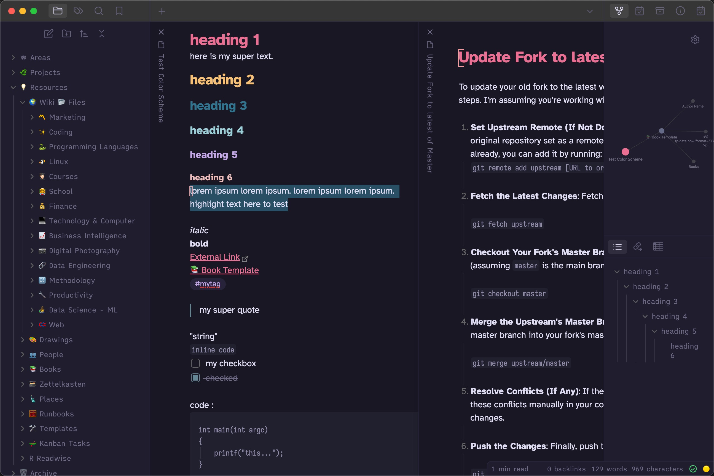

# Obsidian Rosé ~~Pine~~ Bouquet
This is a [Rosé Pine](https://github.com/rose-pine/rose-pine-theme) fork for [Obsidian](https://obsidian.md/). This fork only uses the Bouquet variation based on KAM Bouquet by Adobau Labs

Installation: Simply search `Rosé Pine` in the Obsidian Communitiy Themes and Install. Or if manually, copy the `theme.css` file to your vault directory and reload Obsidian for it to take effect.

* [Color Palette](https://rosepinetheme.com/palette/ingredients/)
